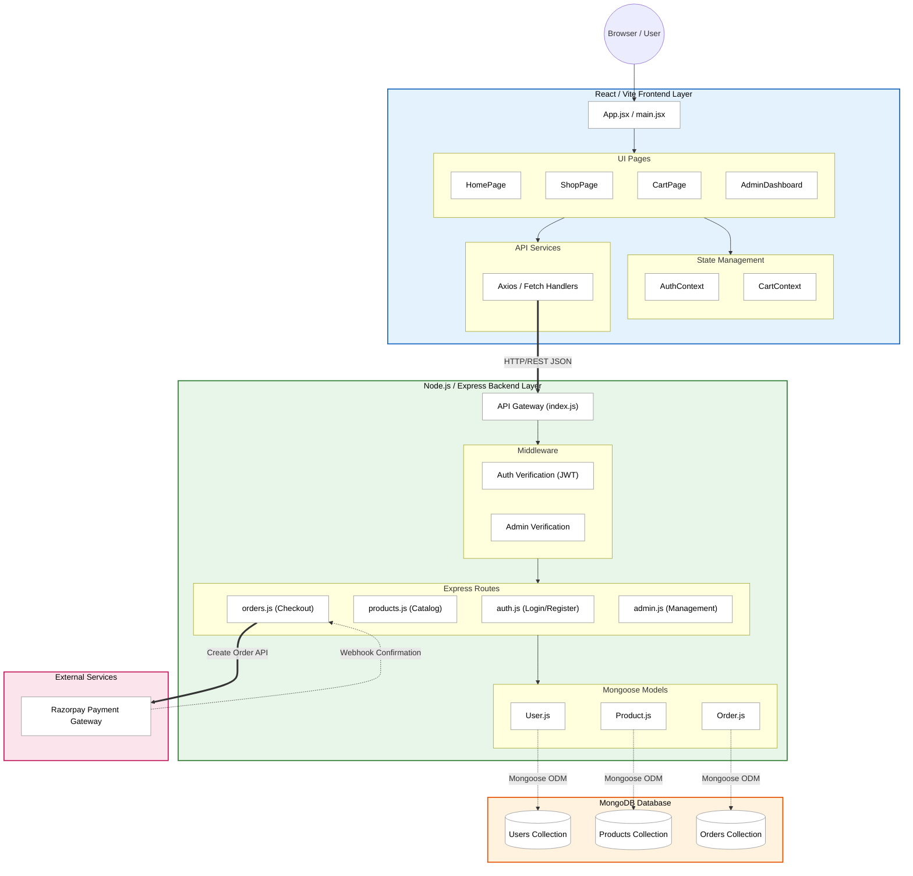

# Samrat Solar - Detailed Architecture Diagram

The diagram below maps out the exact internal structure of your project based on the files present in your `src` and `server` folders.

### Explaining the Deep Architecture

1. **The User Flow:** A user opens the app and hits `App.jsx`. They navigate to a page like `ShopPage`.
2. **Global State:** If they add an item to their cart, it triggers `CartContext` in the frontend state.
3. **API Request:** When checking out, `CartPage` uses the **API Services** to construct a POST request.
4. **Backend Routing:** The Express server (`index.js`) receives the request. It passes through **Middleware** to verify the user's JWT.
5. **Business Logic:** If authenticated, the request hits the `orders.js` route. 
6. **Payment Gateway:** The route reaches out to **Razorpay** to initialize a payment intent.
7. **Database Storage:** Once confirmed, the `Order.js` model communicates with **MongoDB** to permanently save the record.
